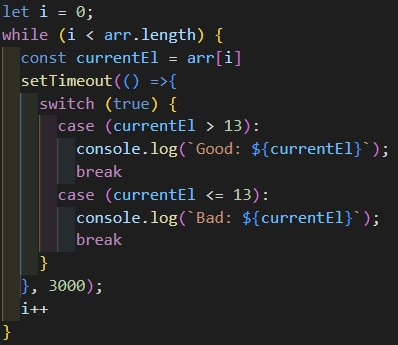

# Тестовое задание - теория п.1

1. Написать что выводит данный код. Предложите 2 варианта модификации кода, чтобы ответ был следующим: Bad: 10, Bad: 12, Good: 15, Good: 21

**Ответ:**

Код в первоначальном состоянии выдаcт - bad: undefined 4 раза. Т.к. var глобальная переменная, в setTimeout хранится ссылка на эту перменную, а такого индекса нет.

Нужно изменить var на let.

После изменения данный код перебирает циклом for массив. Далее функция используя тернарный оператор выводит в консоль сообщение для каждого значения по установленному правилу: если значение больше 13, то в консоли появляется “Good: значение”, иначе “Bad: значение”. Значения выводятся с задержкой 3 секунды.

Модификация-1:

Модификация-2:

**Ссылка на работу**

* [теория п.1](https://kiokoshinkai.github.io/task_from_UniBase/theory-1)
